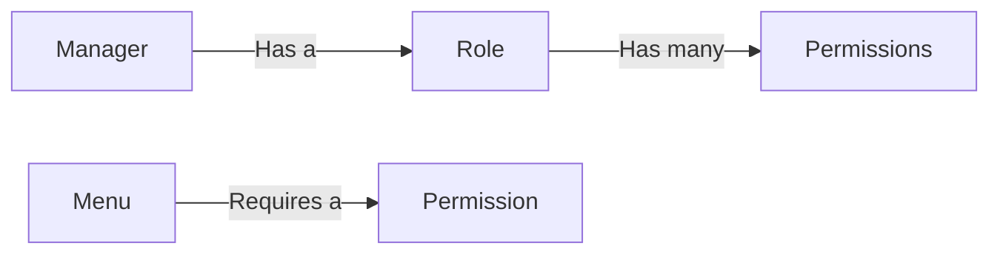

# 마이소호 백오피스 백엔드

이 프로젝트는 마이소호 백오피스의 백엔드 시스템입니다. NestJS 프레임워크를 기반으로 구축되었습니다.

## 인증 시스템 (Authentication)

백엔드 시스템의 인증은 JWT(JSON Web Token)를 사용한 SSO(Single Sign-On) 방식으로 처리됩니다.

### 인증 흐름

1.  **SSO 로그인 요청:** 외부 SSO 시스템에서 인증을 완료한 후, 프론트엔드에서 관리자 `userId`를 받아 `/auth/manager/sso-login` 엔드포인트로 요청을 보냅니다.

2.  **토큰 발급:**
    -   서버는 전달받은 `userId`를 사용해 `manager` 테이블에서 관리자 정보를 조회합니다.
    -   관리자 정보가 확인되면, **Access Token**과 **Refresh Token**을 생성하여 발급합니다.
        -   **Access Token (액세스 토큰):**
            -   Payload: `{ username, sub, type }`
            -   유효기간: 15분
            -   전달 방식: API 응답 본문
        -   **Refresh Token (리프레시 토큰):**
            -   유효기간: 7일
            -   전달 방식: `HttpOnly` Secure Cookie

3.  **API 접근:**
    -   클라이언트는 발급받은 `accessToken`을 `Authorization: Bearer <token>` 헤더에 담아 API를 요청합니다.
    -   서버의 `JwtStrategy`는 이 토큰을 검증합니다.
    -   검증이 성공하면, 토큰의 payload에 포함된 사용자 정보(`username`)를 이용해 DB에서 전체 관리자 프로필(역할 및 권한 포함)을 조회하여 `request.user` 객체에 첨부합니다.

4.  **액세스 토큰 갱신:**
    -   `accessToken`이 만료되면, 클라이언트는 `/auth/manager/refresh` 엔드포인트로 요청을 보냅니다.
    -   이때 요청에는 쿠키에 담긴 `refreshToken`이 자동으로 포함됩니다.
    -   서버는 `refreshToken`을 검증하고, 유효하다면 새로운 `accessToken`을 발급합니다.

### 주요 인증 관련 파일

-   `src/auth/auth.controller.ts`: 로그인, 토큰 갱신, 프로필 조회 API 엔드포인트 정의.
-   `src/auth/auth.service.ts`: JWT 생성 및 검증 로직 담당.
-   `src/auth/jwt.strategy.ts`: Passport-JWT 전략을 구현하여 API 요청의 `Bearer` 토큰을 검증하고 `request.user`를 주입.

---

## 권한 시스템 (Authorization)

백오피스의 접근 제어는 역할 기반 권한 시스템(RBAC)을 통해 관리됩니다. 주요 구성 요소는 다음과 같습니다.

### 1. 관리자 (Managers)

-   **테이블:** `manager`
-   **설명:** 백오피스에 로그인하는 사용자 계정입니다. 각 관리자는 하나의 역할을 가집니다.
-   **주요 컬럼:**
    -   `mng_id`: 관리자 고유 ID
    -   `mng_user`: 로그인 아이디
    -   `mng_name`: 관리자 이름
    -   `role_code`: 할당된 역할 코드

### 2. 역할 (Roles)

-   **테이블:** `roles`
-   **설명:** 관리자에게 부여되는 역할의 집합입니다. (예: 최고 관리자, 운영자, 서포터). 역할은 여러 권한을 가질 수 있습니다.
-   **주요 컬럼:**
    -   `role_code`: 역할 고유 코드 (e.g., `SUPER_ADMIN`)
    -   `role_name`: 역할 이름 (e.g., `최고 관리자`)

### 3. 권한 (Permissions)

-   **테이블:** `permissions`
-   **설명:** 시스템의 특정 기능이나 데이터에 접근할 수 있는 개별 권한입니다. (예: 상점 목록 조회, 공지사항 관리).
-   **주요 컬럼:**
    -   `prm_code`: 권한 고유 코드 (e.g., `store:list:read`)
    -   `prm_name`: 권한 이름 (e.g., `상점 목록 조회`)

### 4. 역할-권한 매핑 (Role-Permissions Mapping)

-   **테이블:** `role_permissions`
-   **설명:** 역할과 권한을 연결하는 테이블입니다. 어떤 역할이 어떤 권한을 가지는지 정의합니다.
-   **주요 컬럼:**
    -   `role_code`: 역할 코드
    -   `permission_code`: 권한 코드

### 5. 메뉴 (Menus)

-   **테이블:** `menus`
-   **설명:** 백오피스의 네비게이션 메뉴 구조입니다. 각 메뉴는 특정 권한을 요구할 수 있으며, 해당 권한이 있는 역할의 관리자에게만 메뉴가 표시됩니다.
-   **주요 컬럼:**
    -   `menu_id`: 메뉴 고유 ID
    -   `menu_name`: 메뉴 이름
    -   `menu_path`: 프론트엔드 경로
    -   `permission_code`: 메뉴 접근에 필요한 권한 코드

## 시스템 흐름

전체적인 권한 시스템의 작동 방식은 다음과 같습니다.

1.  **관리자 로그인:** 관리자가 ID/PW로 로그인합니다.
2.  **역할 확인:** 시스템은 해당 관리자의 `manager` 정보를 통해 `role_code`를 확인합니다.
3.  **권한 확인:** `role_permissions` 테이블을 참조하여 해당 `role_code`에 연결된 모든 `permission_code`를 가져옵니다.
4.  **접근 제어:**
    -   **API 요청:** 특정 API 엔드포인트에 `@Permissions('some:permission')` 와 같이 필요한 권한이 정의되어 있는 경우, 관리자의 권한 목록에 해당 권한이 있는지 확인하여 접근을 허용/거부합니다.
    -   **메뉴 표시:** 관리자의 권한 목록을 기반으로 접근 가능한 메뉴만 필터링하여 화면에 표시합니다.

